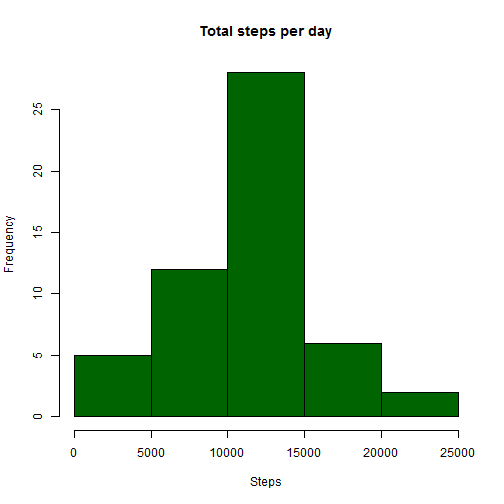
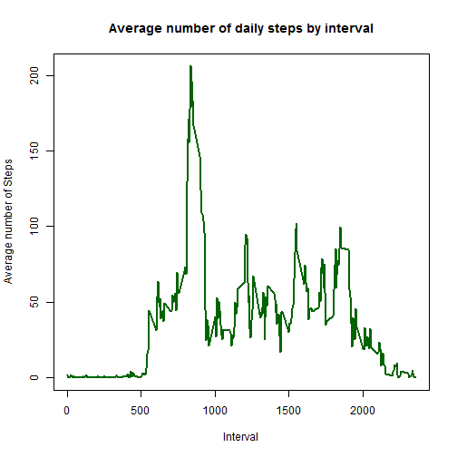
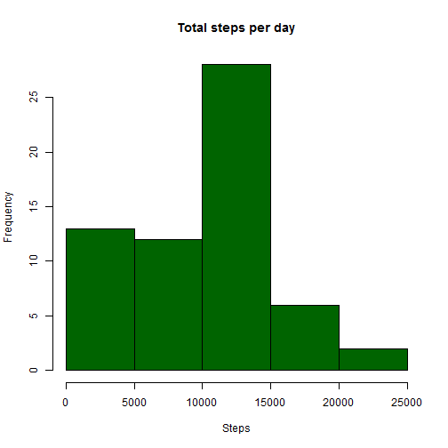
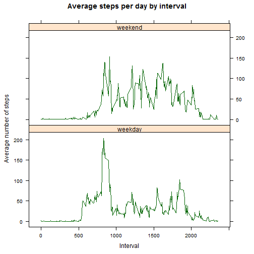

```r
echo = TRUE
options(scipen = 1)
```

### Loading and preprocessing the data

Assuming that zip file is present, unzip it and read it into `rawData`, eliminate rows that have NA and put into `completeData`.


```r
unzip("activity.zip")
rawData <- read.csv("activity.csv", colClasses=c("integer","Date","integer"))
completeData <- na.omit(rawData)
head(completeData)
```

```
##     steps       date interval
## 289     0 2012-10-02        0
## 290     0 2012-10-02        5
## 291     0 2012-10-02       10
## 292     0 2012-10-02       15
## 293     0 2012-10-02       20
## 294     0 2012-10-02       25
```

### What is mean total number of steps taken per day?

Using aggregation, compute total steps per day into `totalStepsPerDay` and use it for ploting histogram and to calculate mean and median.


```r
## Calculate the total number of steps taken per day
totalStepsPerDay = aggregate(steps~date, completeData, sum)
head(totalStepsPerDay)
```

```
##         date steps
## 1 2012-10-02   126
## 2 2012-10-03 11352
## 3 2012-10-04 12116
## 4 2012-10-05 13294
## 5 2012-10-06 15420
## 6 2012-10-07 11015
```

```r
## Make a histogram of the total number of steps taken each day
hist(totalStepsPerDay$steps, main="Total steps per day", col="darkgreen",
     xlab="Steps")
```

 

```r
## Calculate and report the mean and median of the total number of steps taken 
## per day
mean(totalStepsPerDay$steps)
```

```
## [1] 10766.19
```

```r
median(totalStepsPerDay$steps)
```

```
## [1] 10765
```

### What is the average daily pattern?

Using aggregation, compute average steps per interval into `averageStepsPerInterval` and use it for ploting the time series and to find out which interval has the maximum average.


```r
## Calculate the average steps taken per 5-minute interval
averageStepsPerInterval <- aggregate(steps~interval, completeData, mean)
names(averageStepsPerInterval)[2] <- "averageSteps"
head(averageStepsPerInterval)
```

```
##   interval averageSteps
## 1        0    1.7169811
## 2        5    0.3396226
## 3       10    0.1320755
## 4       15    0.1509434
## 5       20    0.0754717
## 6       25    2.0943396
```

```r
## Make a time series plot of the 5-minute interval (xaxis) and the average 
## number of steps taken, averaged across all days (yaxis)
plot(averageStepsPerInterval$interval, averageStepsPerInterval$averageSteps, 
     type="l", xlab="Interval", ylab="Average number of Steps", col="darkgreen",
     bg="lightgray", lwd=2, main="Average number of daily steps by interval")
```

 

```r
## Which 5-minute interval, on average across all the days in the dataset 
## contains the maximum number of steps?
averageStepsPerInterval[which.max(averageStepsPerInterval$averageSteps),]
```

```
##     interval averageSteps
## 104      835     206.1698
```

### Imputing missing values

Note that there are a number of days/intervals where there are missing values (coded as NA ). The presence of missing days may introduce bias into some calculations or summaries of the data. 

*The strategy to fill missing values in steps column is to use the corresponding average steps of interval rounded to integer (no decimals).*


```r
## Calculate and report the total number of missing values in the dataset 
## (i.e. the total number of rows with NA s)
sum(!complete.cases(rawData))
```

```
## [1] 2304
```

```r
## Devise a strategy for filling in all of the missing values in the dataset. 
## The strategy does not need to be sophisticated. For example, you could use
## the mean/median for that day, or the mean for that 5-minute interval, etc.
## Create a new dataset that is equal to the original dataset but with the 
## missing data filled in.
filledData <- rawData
for (i in 1:nrow(rawData)) {
        if (!complete.cases(rawData[i,])) {
                filledData$steps[i] <- 
                    round(averageStepsPerInterval[which(rawData$interval[1]
                    == averageStepsPerInterval$interval),]$averageSteps)
        }
}
head(rawData)
```

```
##   steps       date interval
## 1    NA 2012-10-01        0
## 2    NA 2012-10-01        5
## 3    NA 2012-10-01       10
## 4    NA 2012-10-01       15
## 5    NA 2012-10-01       20
## 6    NA 2012-10-01       25
```

```r
head(filledData)
```

```
##   steps       date interval
## 1     2 2012-10-01        0
## 2     2 2012-10-01        5
## 3     2 2012-10-01       10
## 4     2 2012-10-01       15
## 5     2 2012-10-01       20
## 6     2 2012-10-01       25
```

```r
## Make a histogram of the total number of steps taken each day and calculate 
## and report the mean and median total number of steps taken per day. Do these
## values differ from the estimates from the first part of the assignment? What
## is the impact of imputing missing data on the estimates of the total daily 
## number of steps?
totalStepsPerDayFilled = aggregate(steps~date, filledData, sum)
head(totalStepsPerDayFilled)
```

```
##         date steps
## 1 2012-10-01   576
## 2 2012-10-02   126
## 3 2012-10-03 11352
## 4 2012-10-04 12116
## 5 2012-10-05 13294
## 6 2012-10-06 15420
```

```r
## Make a histogram of the total number of steps taken each day
hist(totalStepsPerDayFilled$steps, main="Total steps per day", col="darkgreen",
     xlab="Steps")
```

 

```r
## Calculate and report the mean and median of the total number of steps taken 
## per day
mean(totalStepsPerDayFilled$steps)
```

```
## [1] 9429.77
```

```r
median(totalStepsPerDayFilled$steps)
```

```
## [1] 10395
```

### Are there differences in activity patterns between weekdays and weekends?

Because my computer locale es México, I have to use **sábado** instead of **saturday** and **domingo** instead of **sunday**, if you want to run this code in your computer, it would be necessary make the corresponding adjustments for your locale.

As the plot shows, weekends show more activity in general, but weekdays have a higher peak just before 1000-minute interval.


```r
## Create a new factor variable in the dataset with two levels - "weekday" and
## "weekend" indicating whether a given date is a weekday or weekend day.
dayType <- weekdays(filledData$date)
weekend <- dayType == "sábado" | dayType == "domingo"
dayType[weekend] <- "weekend"
dayType[!weekend] <- "weekday"
patternData <- cbind(filledData,factor(dayType))
names(patternData)[4] <- "daytype"
head(patternData)
```

```
##   steps       date interval daytype
## 1     2 2012-10-01        0 weekday
## 2     2 2012-10-01        5 weekday
## 3     2 2012-10-01       10 weekday
## 4     2 2012-10-01       15 weekday
## 5     2 2012-10-01       20 weekday
## 6     2 2012-10-01       25 weekday
```

```r
## Make a panel plot containing a time series plot (i.e. type = "l" ) of the
## 5-minute interval (xaxis) and the average number of steps taken, averaged 
## across all weekday days or weekend days (yaxis).
avgStepsPerIntervalType <- aggregate(steps~interval+daytype, patternData, mean)
library(lattice)
xyplot(avgStepsPerIntervalType$steps ~ 
               avgStepsPerIntervalType$interval|avgStepsPerIntervalType$daytype, 
       main="Average steps per day by interval", xlab="Interval", 
       ylab="Average number of steps", layout=c(1,2), type="l", col="darkgreen")
```

 
